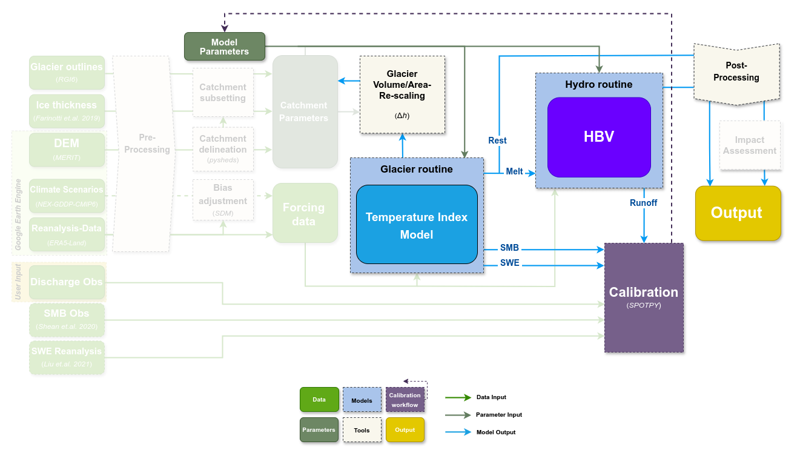

# MATILDA: Modeling wATer resources In gLacierizeD cAtchments

[](https://doi.org/10.5281/zenodo.14267418)


MATILDA is a Python-based modeling framework for simulating water resources in glacierized catchments. This repository contains the core routines of the comprehensive [MATILDA-Online](https://matilda-online.github.io/jbook/) workflow:

1. The *matilda.core* module combines a **temperature-index melt model** with the **HBV model** for hydrological simulations.
2. The *matilda.mspot_glacier* module provides a parameter optimization routine using the [*spotpy*](https://github.com/thouska/spotpy/) library.

While MATILDA can be used as a stand-alone model, the [MATILDA-Online](https://matilda-online.github.io/jbook/) workflow provides comprehensive tools for data acquisition, pre- and post-processing with detailed documentation.



---

## Repository Structure

```
.
├── Example
│   ├── example_workflow.py           # Example script for running MATILDA
│   ├── forcing_data.csv              # Input data for example workflow
│   └── runoff_data.csv               # Observed runoff data
├── matilda
│   ├── core.py                       # MATILDA core routines
│   └── mspot_glacier.py              # Parameter optimization routines
...
```

---

## Installation

The tool's dependencies are set to integrate with [MATILDA-Online](https://matilda-online.github.io/jbook/). It requires Python 3.11 and the following libraries:
```
- xarray
- numpy
- pandas
- matplotlib
- scipy
- datetime
- hydroeval
- HydroErr
- plotly
- spotpy
- pyyaml
```

The MATILDA package and it's dependencies can be installed on your local machine using pip or a similar package manager. You can either install the package by using the link to this repository:
```
pip install git+https://github.com/cryotools/matilda.git
```
...or clone this repository to your local machine, navigate to the top-level directory and use it:
```
pip install .
```
---

## Usage

A detailed walkthrough of the proposed modeling workflow and calibration strategy can be found at the [MATILDA Online Webpage](https://matilda-online.github.io/jbook/). For a quick start to the stand-alone model, see the [application example](https://github.com/cryotools/matilda/tree/styling/Example) and use the following guidelines.

### Forcing Data

The minimum input is a CSV file containing time series of air temperature (°C or K), total precipitation (mm), and (if available) evapotranspiration (mm) data in the format shown below. If evapotranspiration is not provided, it is estimated from air temperature according to [Oudin et.al. 2010](https://doi.org/10.1080/02626660903546118). A series of discharge observations (mm) is used to calibrate the model. If no discharge data are provided, the model runs with default parameters. All datasets require daily resolution.

| TIMESTAMP           | T2    | RRR  | PE   |
|---------------------|-------|------|------|
| 2011-01-01 00:00:00 | -18.2 | 0.00 | 0.00 |
| 2011-01-01 01:00:00 | -18.3 | 0.1  | 0.00 |
| 2011-01-01 02:00:00 | -18.2 | 0.1  | 0.00 |
| ...                 | ...   | ...  | ...  |

| Date       | Qobs |
|------------|------|
| 2011-01-01 | 0.17 |
| 2011-01-01 | 0.19 |
| ...        | ...  |


The forcing data are scaled to the mean elevations of the glacierized and ice-free subcatchments, respectively, using linear lapse rates. Reference elevations must be provided for the input data, the entire catchment, and the glacierized fraction. Automated routines for catchment delineation and public data download can be found in the [MATILDA Online](https://matilda-online.github.io/jbook/) workflow.

### Glacier Data

To apply the **Δh** parameterization of [Huss and Hock 2015](https://doi.org/10.3389/feart.2015.00054) within the DDM routine to calculate glacier evolution over the study period, you need to provide data on the initial glacier cover. The routine requires an initial glacier profile containing the spatial distribution of ice over elevation bands at the beginning of the study period in the form of a dataframe:

| Elevation | Area  | WE        | EleZone |
|-----------|-------|-----------|---------|
| 3720 		   | 0.005 | 10786.061 | 3700	   |
| 3730  	   | 0.001 | 13687.801 | 3700 	  |
| 3740  	   | 0.001 | 12571.253 | 3700 	  |
| 3750  	   | 0.002 | 12357.987 | 3800 	  |
| ..  	     | ...   | ...       | ... 	   |

* Elevation - elevation of each band (10 m intervals recommended)
* Area - glacierized area in each band as a fraction of the total catchment area (column sum is the glacierized fraction of the total catchment)
* WE - ice thickness in mm w.e.
* EleZone - combined bands across 100-200 m.


---

## Parameter List

MATILDA has 21 non-optional parameters, most of which are HBV standard parameters.


| **Parameter**        | **Description**                                                                 | **Unit/Range**        | **Default Value**     |
|-----------------------|---------------------------------------------------------------------------------|-----------------------|-----------------------|
| `lr_temp`            | Temperature lapse rate                                                         | °C m⁻¹               | -0.006               |
| `lr_prec`            | Precipitation lapse rate                                                       | mm m⁻¹               | 0                    |
| `TT_snow`            | Threshold temperature for snow                                                 | °C                   | 0                    |
| `TT_diff`            | Temperature range for rain-snow transition                                     | °C                   | 2                    |
| `CFMAX_snow`         | Melt factor for snow                                                           | mm °C⁻¹ day⁻¹        | 5                    |
| `CFMAX_rel`          | Melt factor for ice relative to snow                                           | -                    | 2                    |
| `BETA`               | Shape coefficient for soil moisture routine                                    | -                    | 1.0                  |
| `CET`                | Correction factor for evapotranspiration                                       | -                    | 0.15                 |
| `FC`                 | Field capacity of soil                                                         | mm                   | 250                  |
| `K0`                 | Recession coefficient for surface flow                                         | day⁻¹                | 0.055                |
| `K1`                 | Recession coefficient for intermediate groundwater flow                       | day⁻¹                | 0.055                |
| `K2`                 | Recession coefficient for deep groundwater flow                                | day⁻¹                | 0.04                 |
| `LP`                 | Fraction of field capacity where evapotranspiration is at its maximum          | -                    | 0.7                  |
| `MAXBAS`             | Length of triangular routing function                                          | day                  | 3.0                  |
| `PERC`               | Percolation rate from upper to lower groundwater reservoir                     | mm day⁻¹             | 1.5                  |
| `UZL`                | Threshold for quick flow from upper zone                                       | mm                   | 120                  |
| `PCORR`              | Precipitation correction factor                                                | -                    | 1.0                  |
| `SFCF`               | Snowfall correction factor                                                     | -                    | 0.7                  |
| `CWH`                | Water holding capacity of snowpack                                             | -                    | 0.1                  |
| `AG`                 | Glacier area correction factor                                                 | -                    | 0.7                  |
| `CFR`                | Refreezing coefficient                                                         | -                    | 0.15                 |

---

## Authors

* **Phillip Schuster** - *Lead* - (https://github.com/phiscu)
* **Alexander Georgi** - *Visualization and Integration with MATILDA-Online* - (https://github.com/geoalxx)
* **Ana-Lena Tappe** - *Initial work* - (https://github.com/anatappe)

See also the list of [contributors](https://www.geographie.hu-berlin.de/en/professorships/climate_geography/research-2/climate-change-and-cryosphere-research/ebaca) who participated in the initial project funded by the [GIZ](https://www.giz.de/de/downloads/giz2019-EN-Enhancing-Livelihoods.pdf).

## License

This project is licensed under the MIT License.

---

## References

The development of MATILDA integrated several well-established hydrological and glacier modeling tools. References for the primary methods and libraries used in the model are listed below:

**PyPDD (Temperature-Index Model):**

  - Seguinot, J. (2019). PyPDD: a positive degree day model for glacier surface mass balance (Version v0.3.1). Zenodo. [http://doi.org/10.5281/zenodo.3467639](http://doi.org/10.5281/zenodo.3467639)

**LHMP and HBV Models:**

  - Ayzel, G. (2016). Lumped Hydrological Models Playground. [github.com/hydrogo/LHMP](https://github.com/hydrogo/LHMP.git), [doi:10.5281/zenodo.59680](https://doi.org/10.5281/zenodo.59680).
  - Ayzel G. (2016). LHMP: lumped hydrological modelling playground. Zenodo. [doi:10.5281/zenodo.59501](https://doi.org/10.5281/zenodo.59501).
  - Bergström, S. (1992). The HBV model: Its structure and applications. Swedish Meteorological and Hydrological Institute. [PDF](https://www.smhi.se/polopoly_fs/1.83592!/Menu/general/extGroup/attachmentColHold/mainCol1/file/RH_4.pdf)

**Δh (delta-h) Parametrization:**

  - Seibert et.al. (2018). Representing glacier geometry changes in a semi-distributed hydrological model. [https://doi.org/10.5194/hess-22-2211-2018](https://doi.org/10.5194/hess-22-2211-2018)
  
**SPOTPY (Parameter Optimization):**

  - Houska, T., Kraft, P., Chamorro-Chavez, A., & Breuer, L. (2015). SPOTting Model Parameters Using a Ready-Made Python Package. *PLOS ONE*, 10(12), 1–22. [http://doi.org/10.1371/journal.pone.0145180](http://doi.org/10.1371/journal.pone.0145180)


