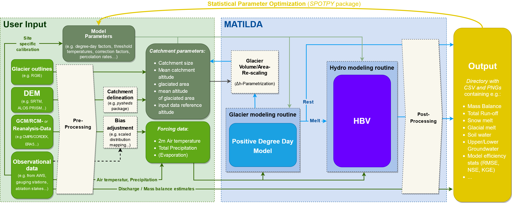

# MATILDA - Modeling Water Resources in Glacierized Catchments

The MATILDA framework combines a simple positive degree-day routine (DDM) to compute glacial melt with the hydrological bucket model HBV (Bergström, 1986). The aim is to provide an easy-access open-source tool to assess the characteristics of small and medium-sized glacierized catchments and enable users to estimate future water resources for different climate change scenarios.
MATILDA is an ongoing project and therefore a ***work in progress***.

## Overview

In the basic setup, MATILDA uses a modified version of the [pypdd](https://github.com/juseg/pypdd.git) tool to calculate glacial melt based on a positive degree-day approach and a modified version of HBV from the Lumped Hydrological Models Playground ([LHMP](https://github.com/hydrogo/LHMP.git)). The output contains the modeled time series for various components of the water balance, basic statistics for these variables, a choice of model effieciency coefficients (e.g. NSE, KGE...), and several plots of in- and output data.



### Requirements

The tool should run with every Python3 version on most computer operating systems. It was developed on Python 3.6.9 on Ubuntu 20.04.
It requires the following Python3 libraries:
- xarray
- numpy
- pandas
- matplotlib
- scipy
- datetime
- hydroeval
- HydroErr
- Plotly

The MATILDA package and dependencies can be installed to your local machine by using pip or a comparable package manager. You can either install the package by using the link to this repository:
```
pip install -e 'git+https://github.com/cryotools/matilda.git/#egg=matilda&subdirectory=matilda_v0.3'
```
...or clone this repository to you local machine, navigate to the matilda_v0.2 directory and use:
```
pip install .
```

### Data

The minimum input is a CSV-file containing timeseries of air temperature (°C), total precipitation (mm) and (if available) evapotranspiration data (mm) in the format shown below. If evapotranspiration is not provided it is estimated from air temperature following [Oudin et.al. 2010](https://doi.org/10.1080/02626660903546118). A series of runoff observations (mm) is used to calibrate/validate the model. All data sets need at least daily resolution.

| TIMESTAMP           | T2    | RRR  | PE   |
|---------------------|-------|------|------|
| 2011-01-01 00:00:00 | -18.2 | 0.00 | 0.00 |
| 2011-01-01 01:00:00 | -18.3 | 0.1  | 0.00 |
| 2011-01-01 02:00:00 | -18.2 | 0.1  | 0.00 |
| ...                 | ...   | ...  | ...  |

| Date       | Qobs |
|------------|------|
| 2011-01-01 | 0.17 |
| 2011-01-01 | 0.19 |
| ...        | ...  |


The forcing data is scaled to the mean glacier elevation and the mean catchment elevation respectively using linear lapse rates. Reference altitudes for the input data, the whole catchment, and the glacierized fraction need to be provided. Automated routines for catchment delineation and the download of public glacier data will be added to MATILDA in future versions.

To include the deltaH parameterization from [Huss and Hock 2015](https://doi.org/10.3389/feart.2015.00054) within the DDM routine to calculate glacier area evolution in the study period, information on the glaciers is necessary. The routine requires an initial glacier profile containing the spatial distribution of ice over elevation bands at the beginning of the study period in form of a dataframe:

| Elevation | Area  | WE        | EleZone |
|-----------|-------|-----------|---------|
| 3720 		   | 0.005 | 10786.061 | 3700	   |
| 3730  	   | 0.001 | 13687.801 | 3700 	  |
| 3740  	   | 0.001 | 12571.253 | 3700 	  |
| 3750  	   | 0.002 | 12357.987 | 3800 	  |
| ..  	     | ...   | ...       | ... 	   |

* Elevation - elevation of each band (10 m intervals recommended)
* Area - area of each band as a fraction of the total glacier area
* WE -  ice thickness in m w.e.
* EleZone - combined bands over 100-200 m.

The deltaH parametrization routine is based on the workflow outlined by [Seibert et.al. (2018)](https://doi.org/10.5194/hess-22-2211-2018).
### Workflow

The MATILDA package consists of four different modules: parameter setup, data preprocessing, core simulation, and postprocessing. All modules can be used individually or via the superior *MATILDA_simulation* function. 
To use the full workflow the following steps are recommended:
- Load your data.
- Define the spin-up and simulation periods. At least one year of spin-up is recommended.
- Specify your catchment properties (catchment area, glacierized area, average elevation, average glacier elevation).
- Define the output frequency (daily, weekly, monthly or yearly).
- Specify parameters as you please using the *MATILDA_parameter* function. If no parameters are specified, default values are applied.
- Run the data preprocessing with the *MATILDA_preproc* function.
- Run the actual simulation with the *MATILDA_submodules* function.
- The simulation will give you a quick overview of your output and (if you provide observations) model efficiency coefficients are calculated.
- Plot runoff, meteorological parameters, and HBV output variables using *MATILDA_plots* function. 
- All the output including the plots and parameters can be saved to your local disk with the *MATILDA_save_output* function.

## Application example
An example script and 3y of sample data can be found [here](Example/example_workflow.py).

## Built using
* [pypdd](https://github.com/juseg/pypdd.git) - Python positive degree day model for glacier surface mass balance
* [LHMP](https://github.com/hydrogo/LHMP) - Lumped Hydrological Models Playgroud - HBV Model

## Authors

* **Phillip Schuster** - *Initial work* - (https://github.com/phiscu)
* **Ana-Lena Tappe** - *Initial work* - (https://github.com/anatappe)


See also the list of [contributors](https://www.geographie.hu-berlin.de/en/professorships/climate_geography/research-2/climate-change-and-cryosphere-research/ebaca) who participated in this project.

## License

This project is licensed under the MIT License.

### References

* For PyPDD:
  * Seguinot, J. (2019). PyPDD: a positive degree day model for glacier surface mass balance (Version v0.3.1). Zenodo. http://doi.org/10.5281/zenodo.3467639

* For LHMP and HBV:
    * Ayzel, G. (2016). Lumped Hydrological Models Playground. [github.com/hydrogo/LHMP](https://github.com/hydrogo/LHMP.git), [doi:10.5281/zenodo.59680](https://doi.org/10.5281/zenodo.59680). 
    * Ayzel G. (2016). LHMP: lumped hydrological modelling playground. Zenodo. [doi:10.5281/zenodo.59501](https://doi.org/10.5281/zenodo.59501). 
    * Bergström, S. (1992). The HBV model: Its structure and applications. Swedish Meteorological and Hydrological Institute. [PDF](https://www.smhi.se/polopoly_fs/1.83592!/Menu/general/extGroup/attachmentColHold/mainCol1/file/RH_4.pdf)
* For the deltaH parametrization:
  * Seibert et.al. (2018). Representing glacier geometry changes in a semi-distributed hydrological model. [https://doi.org/10.5194/hess-22-2211-2018](https://doi.org/10.5194/hess-22-2211-2018)
